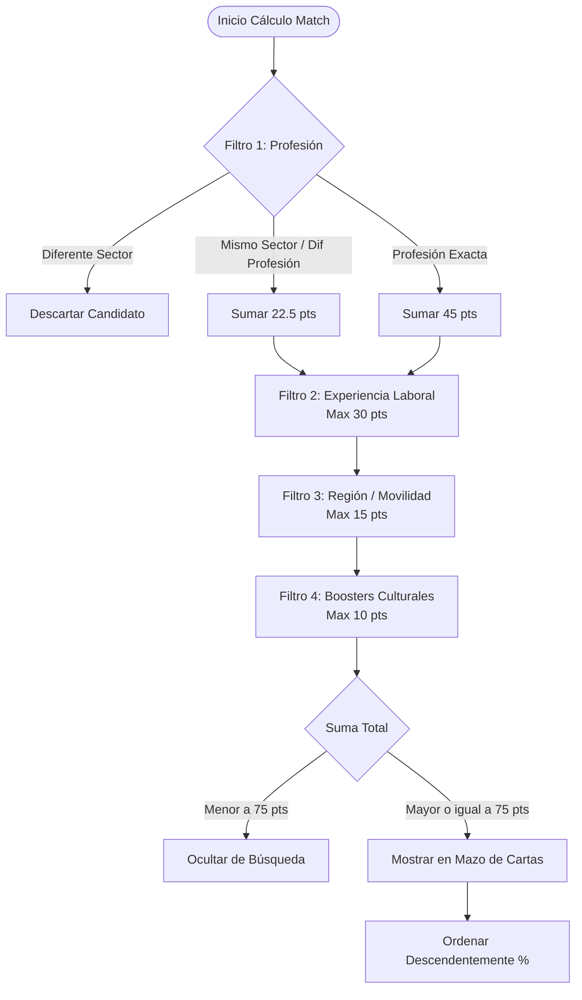

# Plan de Desarrollo y Arquitectura del Proyecto Web: MatChile

Este documento presenta el plan de desarrollo técnico, funcional y de arquitectura para **MatChile**, un motor de match inteligente en tiempo real para el mercado laboral chileno. Este plan se ha personalizado según las decisiones de diseño adoptadas: backend en Django con PostgreSQL, frontend en Vue 3 con Vite y Tailwind CSS 3, y autenticación gestionada mediante Auth0.

---

## 1. Resumen Ejecutivo y Propósito del Sistema

**MatChile** es una plataforma B2B SaaS diseñada para el sector EdTech, capacitación y contratación laboral en Chile (OTECs, CFTs, IP, Universidades y Empresas). Su propósito es conectar de forma fluida, inclusiva y en tiempo real a postulantes con instituciones contratantes.

### Principios Fundamentales
*   **Velocidad y Tiempo Real:** Conexión directa e instantánea entre las ofertas y los profesionales calificados disponibles, eliminando los procesos largos y la fricción de los portales de empleo tradicionales.
*   **Inclusión Real (Ley N° 21.015):** Accesibilidad universal nativa (criterios WCAG 2.1) y un flujo transparente y adaptativo para la inclusión laboral.
*   **Monetización por Valor/Éxito:** Las empresas no pagan por publicar anuncios vacíos; pagan por la apertura de un canal de comunicación directo y validado (el "Match").

---

## 2. Arquitectura del Sistema y Stack Tecnológico

La plataforma adopta una arquitectura desacoplada basada en API REST, lo que permite un desarrollo independiente y robusto de ambas capas.

```mermaid
graph TD
    subgraph Frontend [Aplicación Cliente - Mobile First]
        UI["Vue.js 3 + Vite + Tailwind CSS 3 (SPA)"]
        A0_Vue["Auth0 SDK (@auth0/auth0-vue)"]
        PDF["jsPDF (Client-Side PDF Generator)"]
    end

    subgraph Backend [Backend Django]
        DRF["Django REST Framework (APIs)"]
        A0_Py["Auth0 JWT Validation Middleware"]
        LLM["AI Engine (OpenAI / Gemini API)"]
        Admin["Django Admin Panel (Gestión Maestra)"]
    end

    subgraph Persistencia [Base de Datos]
        DB["PostgreSQL (Tablas relacionales)"]
        MatchEngine["Match Engine (ORM / Raw SQL Queries)"]
    end

    UI -->|API Requests (JWT)| DRF
    UI -->|Genera Localmente| PDF
    UI -->|Autenticación Auth0| A0_Vue
    DRF -->|Valida Tokens| A0_Py
    DRF -->|ORM SQL| DB
    DRF -->|Llamadas Asíncronas (Prompts)| LLM
    DB -->|Ejecuta Filtros & Umbrales| MatchEngine
```

### Justificación y Stack Tecnológico
1.  **Frontend (Vue.js 3 + Vite + Tailwind CSS 3):**
    *   **Vue.js 3:** Usará la Composition API para modularizar y gestionar el estado (ej. mediante Pinia). Proporciona excelente reactividad y velocidad.
    *   **Vite:** Herramienta de compilación ultrarrápida.
    *   **Tailwind CSS 3:** Para diseñar una interfaz premium desde cero, dejando de lado el mockup simplista de `Matchile.html` y logrando un estilo visual moderno, animaciones fluidas y soporte completo de accesibilidad.
2.  **Backend (Django + Django REST Framework):**
    *   **Django:** Una decisión excelente y madura. Django posee soporte nativo e impecable para **PostgreSQL**, un ORM muy potente para consultas complejas, y cuenta con un **panel de administración integrado (Django Admin)** que facilita enormemente la gestión interna de la base de datos maestra (Sectores, Carreras) y la verificación de candidatos del Sello MatChile.
    *   **Django REST Framework (DRF):** Para exponer los endpoints REST protegidos.
3.  **Base de Datos (PostgreSQL):**
    *   Soporte robusto para búsquedas relacionales y consultas complejas de coincidencia (Match).
4.  **Autenticación (Auth0):**
    *   **Frontend:** Uso del SDK `@auth0/auth0-vue` para iniciar sesión y obtener JWTs de manera rápida y segura.
    *   **Backend:** Validación de JWT en Django mediante JSON Web Keys (JWKS) provistos por Auth0, protegiendo las llamadas a la API sin necesidad de almacenar credenciales de usuario locales.
5.  **Pasarela de Pagos:**
    *   *Pospuesta para futura fase:* El módulo de monetización se estructurará a nivel de base de datos (conteo de tokens y planes), pero la conexión con Fintoc / Webpay queda en pausa en el backlog.

---

## 3. Modelo de Datos (PostgreSQL en Django ORM)

Django se conectará a PostgreSQL y definirá los siguientes modelos:

### 3.1. Estructura de la Base de Datos Maestra
*   **Sector:** Ej. Tecnología y Telecomunicaciones, Salud y Bienestar.
*   **Profesion:** Relacionado con Sector. Contiene el nivel educativo.
*   **Certificacion:** Relacionado con Profesion (lit. `"Certificaciones"` en toda la lógica).

### 3.2. Modelo de Postulante (Estructura Django Models / JSON)
```python
# Modelos conceptuales en Django

class Postulante(models.Model):
    auth0_id = models.CharField(max_length=255, unique=True) # ID provisto por Auth0
    nombre_legal = models.CharField(max_length=150)
    nombre_social = models.CharField(max_length=150, blank=True, null=True)
    fecha_nacimiento = models.DateField()
    identidad_genero = models.CharField(max_length=50) # Femenino, Masculino, No Binario, etc.
    
    # Contacto
    whatsapp = models.CharField(max_length=30)
    email = models.EmailField(unique=True)
    linkedin = models.URLField(blank=True, null=True)
    
    # Ubicación
    region_residencia = models.CharField(max_length=100)
    comuna_residencia = models.CharField(max_length=100)
    comuna_otra = models.CharField(max_length=100, blank=True, null=True)
    regiones_movilidad = models.JSONField(default=list) # Array de regiones de movilidad
    
    # Formación
    nivel_estudios = models.CharField(max_length=50) # basica, media, tecnico-profesional, universitario
    area_laboral = models.CharField(max_length=150) # Nombre de la carrera
    nivel_laboral = models.CharField(max_length=50) # junior, semi-senior, senior, etc.
    experiencia_total_anos = models.IntegerField(default=0)
    certificaciones = models.TextField(blank=True, null=True) # Campo de texto unificado
    
    # Inclusión
    inclusion_ley_21015 = models.BooleanField(default=False)
    ajustes_razonables = models.JSONField(default=list) # Array de booleanos de ajustes

class ExperienciaLaboral(models.Model):
    postulante = models.ForeignKey(Postulante, on_relationship="CASCADE", related_name="experiencias")
    cargo = models.CharField(max_length=150)
    empresa = models.CharField(max_length=150)
    desde_ano = models.IntegerField()
    hasta_ano = models.IntegerField(blank=True, null=True)
    actual = models.BooleanField(default=False)
    funciones = models.TextField()
```

---

## 4. Algoritmo y Lógica del Motor de Match (Match Engine)

El cálculo del porcentaje de afinidad se efectúa sobre una escala máxima de **100 Puntos (100%)**, distribuidos en 4 filtros lógicos en el backend.



### Desglose de Puntajes del Algoritmo
1.  **Filtro 1: Profesión (Filtro Excluyente) - Peso: 45 Puntos**
    *   *Coincidencia Exacta:* **45 puntos** (Ej: Solicita "TENS", Candidato es "TENS").
    *   *Coincidencia de Sector (pero diferente carrera):* **22.5 puntos** (Ej: Solicita "TENS", Candidato es "Masoterapia" - ambos son Salud).
    *   *Diferente Sector:* **0 puntos** $\rightarrow$ **Descarte inmediato** (el candidato se excluye de este proceso).
2.  **Filtro 2: Experiencia Laboral - Peso: 30 Puntos**
    *   *Años Candidato $\ge$ Años Solicitados:* **30 puntos**.
    *   *Años Candidato $<$ Años Solicitados:* Proporción lineal:
        $$\text{Puntaje} = \left( \frac{\text{Años Candidato}}{\text{Años Solicitados}} \right) \times 30$$
3.  **Filtro 3: Región y Movilidad - Peso: 15 Puntos**
    *   Si la Región de la Oferta coincide con la región de residencia del candidato o con sus regiones declaradas de movilidad geográfica: **15 puntos**.
    *   Si no coincide: **0 puntos** (No se descarta al candidato).
4.  **Filtro 4: Boosters Culturales (Puntos Extra) - Peso: 10 Puntos**
    *   *Sub-Filtro Inclusión:* Si la Empresa solicita Ley N° 21.015 y el Candidato tiene activo el interruptor de discapacidad: **+5 puntos**.
    *   *Sub-Filtro Certificaciones:* Si la Empresa valora certificaciones y el candidato tiene texto en el campo "Certificaciones": **+5 puntos**.

### Decisión de Despliegue en Interfaz
*   **Umbral Mínimo:** Solo los candidatos con un porcentaje final **$\ge$ 75%** se renderizan en el mazo de cartas de la empresa.
*   **Ordenamiento:** Las tarjetas se ordenan en la UI de forma descendente por porcentaje de match.

---

## 5. Experiencia de Usuario (UI/UX) y Accesibilidad (A11y)

Se diseñará una interfaz premium a medida con **Vue 3** y **Tailwind CSS 3** orientada a la excelencia estética.

### 5.1. Onboarding Deslizable
Construido mediante un carrusel móvil interactivo y animado de 4 pasos:
1.  **Pantalla 1: Propósito.** Logotipo de MatChile e introducción: *"El primer motor de match inteligente..."*
2.  **Pantalla 2: Precisión.** Radar visual: *"Encuentros Precisos y Cercanos..."*
3.  **Pantalla 3: Velocidad.** Reloj transformándose en rayo: *"Directo a lo Importante..."*
4.  **Pantalla 4: Bifurcación (CTA).** Dos tarjetas visualmente ricas con botones claros: **[Soy Empresa]** o **[Soy Postulante]**.

### 5.2. Accesibilidad Universal e Inclusión (WCAG 2.1 & Ley N° 21.015)
*   **Diseño Transparente Adaptativo (A11y):** Al activar el switch de la Ley N° 21.015, el contenedor visual del formulario de Vue elimina fondos y sombras oscuras y adopta un **fondo transparente con tipografías y bordes en color negro sólido (#000000)** para un contraste de color superior a 4.5:1 exigido para personas con baja visión.
*   **Control del Swipe UI por Teclado:** Captura de eventos globales de teclado en Vue (`keydown`):
    *   Tecla Flecha Izquierda ($\leftarrow$): Rechazar candidato.
    *   Tecla Flecha Derecha ($\rightarrow$): Aceptar candidato / Match.
*   **Uso del Nombre Social:** Si el usuario declara un "Nombre Social / Profesional", este tiene **prioridad de impresión**. Reemplaza al nombre legal en las vistas públicas de las empresas y encabeza el currículum PDF descargable generado localmente.

---

## 6. Modelo de Monetización (Backlog de Integración)

*   **Esquema de Tokens y Planes:** Se implementarán en el esquema de base de datos de Django para cuantificar el uso (Plan Premium, saldo de tokens).
*   **Sello "MatChile Verificado":** El candidato paga $4.990 CLP para validar antecedentes (cédula, título, antecedentes). Esto se mostrará con una insignia (Check Azul) que el administrador de la plataforma activará manualmente a través del **Django Admin** una vez verificado el pago e historial.
*   **Pasarela de Pago (Fintoc/Mercado Pago):** *En Veremos*. No se implementará en la primera versión, permitiendo que la plataforma opere de forma gratuita o con activaciones manuales administrativas en el Django Admin para testing inicial.

---

## 7. Reportes Estadísticos Mensuales (Gamificación y ROI)

El backend de Django generará reportes estructurados que luego serán enviados por email o descargados desde la plataforma.

*   **Para Postulantes:** Métricas de visualizaciones en los mazos de empresas, porcentaje de swipe right, consejos automatizados basados en mercado (ej. *"Se buscan mucho estas certificaciones, agrégalas"*), y la invitación a adquirir el Sello Verificado.
*   **Para Empresas:** Eficiencia de reclutamiento (tiempo promedio en lograr match), tasa de aceptación de candidatos, y reportes de cumplimiento Ley N° 21.015 listos para entregar a la Dirección del Trabajo (DT).

---

## 8. Plan de Implementación (Roadmap en 6 Fases)

### Fase 1: Setup del Backend y Frontend (Semanas 1-2)
*   **Backend:** Configurar Django con PostgreSQL y Django REST Framework (DRF). Configurar la autenticación mediante Auth0 con validación de tokens JWT en backend.
*   **Frontend:** Crear aplicación Vue 3 con Vite y Tailwind CSS 3. Integrar `@auth0/auth0-vue` para el flujo de login.
*   Diseñar y maquetar el sistema de diseño en Tailwind 3 (colores premium, tipografías desde Google Fonts e Inter, layouts de escritorio y móvil).

### Fase 2: Modelos, Base de Datos Maestra y Django Admin (Semanas 3-4)
*   Crear modelos en Django para Postulantes, Empresas, Experiencias, Habilidades, Certificaciones y Sectores.
*   Poblar PostgreSQL con los datos oficiales de carreras y certificaciones.
*   Configurar el Django Admin para gestionar usuarios, base de datos maestra y permitir activar manualmente el sello "Verificado" de los candidatos.

### Fase 3: Motor de Match e Integración de IA (Semanas 5-6)
*   Escribir el algoritmo del motor de match en Django utilizando consultas optimizadas (Django ORM).
*   Crear endpoints en Django REST Framework para conectar con APIs de LLM (OpenAI/Gemini) que sirvan a las "Varitas Mágicas" (asistente de funciones laborales y habilidades inclusivas).
*   Implementar atajos de teclado y el modo A11y (diseño contrastado) en el frontend en Vue 3.

### Fase 4: Desarrollo de UI Premium en Vue 3 (Semanas 7-8)
*   Desarrollar el carrusel de onboarding y vistas de registro modularizadas y altamente visuales.
*   Implementar el buscador 3D con filtrado progresivo (Nivel $\rightarrow$ Sector $\rightarrow$ Profesión) para empresas.
*   Construir la pantalla de mazo de cartas (Swipe UI) animada con CSS Transitions nativas de Vue.

### Fase 5: Reportes, Notificaciones y PDF (Semanas 9-10)
*   Programar la lógica de jsPDF en Vue 3 para generar el currículum local del candidato respetando Nombre Social y cabeceras oficiales.
*   Implementar notificaciones por correo electrónico en Django (Resend/SendGrid) gatilladas al momento de que ocurra un Match mutuo.
*   Programar comandos personalizados en Django para el cálculo y estructura de estadísticas mensuales.

### Fase 6: QA, Accesibilidad y Despliegue (Semanas 11-12)
*   Auditorías de accesibilidad universal y pruebas de consistencia de diseño responsive.
*   Despliegue del Frontend (ej. Vercel o Netlify) y del Backend (ej. AWS, Render o Heroku con PostgreSQL en la nube).

---

## 9. Estrategia de Escalabilidad y Rendimiento

Para asegurar que la plataforma MatChile sea capaz de crecer en volumen de usuarios y datos (candidatos y empresas) sin degradar su rendimiento, se adoptan las siguientes directrices arquitectónicas:

### 9.1. Escalabilidad del Backend (Django + PostgreSQL)
*   **Servicio Stateless (Sin Estado):** Gracias a que la autenticación está delegada en **Auth0** y se valida mediante tokens JWT de forma asíncrona, el backend de Django es completamente *stateless*. Esto permite escalar horizontalmente agregando múltiples instancias de la aplicación detrás de un balanceador de carga (como Nginx o AWS ALB) sin preocuparse por la sincronización de sesiones.
*   **Optimización de Consultas en PostgreSQL:**
    *   **Indexación Estratégica:** Se crean índices específicos en PostgreSQL para las columnas críticas del motor de match: `area_laboral`, `nivel_estudios`, `region_residencia`, `inclusion_ley_21015` y `auth0_id`.
    *   **Carga Selectiva (ORM optimization):** Uso de `select_related` y `prefetch_related` en el ORM de Django para evitar el problema de consultas $N+1$ al cargar perfiles de candidatos con sus múltiples experiencias laborales.
    *   **Pool de Conexiones:** Implementación de **PgBouncer** para administrar miles de conexiones simultáneas a la base de datos de forma eficiente.
*   **Caché con Redis:**
    *   La base de datos maestra (Sectores, Carreras y Certificaciones) cambia muy poco. Se guardará en caché utilizando Redis para evitar golpear PostgreSQL en cada registro o autocompletado.
*   **Tareas en Segundo Plano (Background Workers):**
    *   Procesos pesados como la generación y envío de reportes mensuales estadísticos, correos masivos o llamadas a APIs externas de IA no se ejecutarán en el hilo principal de las peticiones HTTP. Se gestionarán en segundo plano usando **Celery** con Redis como broker.

### 9.2. Escalabilidad del Frontend (Vue 3 + Vite)
*   **Dividir Código y Carga Perezosa (Lazy Loading):**
    *   Las vistas y los componentes más pesados (ejemplo: paneles analíticos, formularios de registro largos) se cargarán dinámicamente usando `defineAsyncComponent` de Vue y rutas dinámicas en `Vue Router`. Esto reduce el tamaño del paquete inicial (bundle size), clave para una carga rápida en redes móviles chilenas.
*   **Pinia para el Estado Global:**
    *   Centralización limpia del estado en módulos desacoplados (`auth.js`, `profile.js`, `matching.js`). Esto evita la complejidad del prop-drilling y asegura un flujo unidireccional de datos fácil de escalar a medida que se agreguen más pantallas.
*   **Optimización del Renderizado (Virtual Scrolling):**
    *   Si en el futuro las empresas visualizan el historial de matches en listas largas en lugar de tarjetas individuales, se implementará *Virtual Scrolling* (renderizar solo los elementos visibles en pantalla) para evitar sobrecargar la memoria del navegador móvil.

